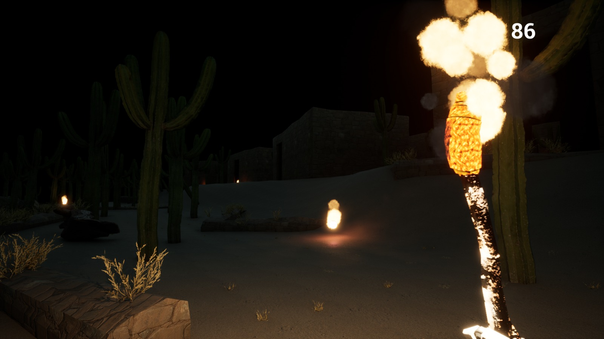
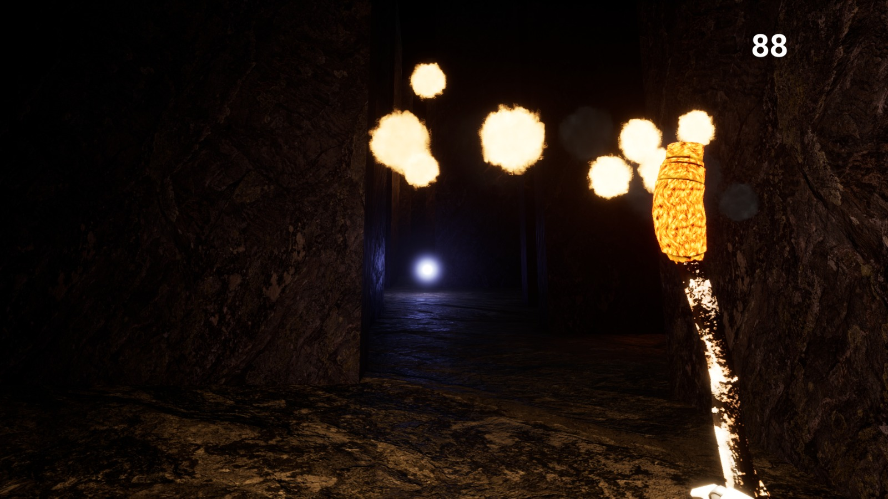

# Labyrinth - Global Game Jam 2023

Entry game for the Global Game Jam 2023. [Official site to the game](https://globalgamejam.org/2023/games/nuwasir-4)

### Possible diversifiers

- Give your NPCs a brain, or even a heart (Sponsored by Inworld)

What if your NPCs had knowledge, motivation and personality? What if your quest giver has a lot more to give? What if the princess doesn’t want to be saved? Surprise and delight players with AI-powered NPCs you create with natural language, then easily integrate them into your Unity, Unreal or node.js project.

- Tour Guide

The art of your game showcases cultural aspects of places you like.
 
## Description
**Labyrinth** is a 3d first person terror/exploration game where you will play as a Quilmes native aboriginal warrior who was killed and has to escape the labyrinth taking fast decisions to escape the monsters.

## Installation

### Requirements:
- [Unreal Engine 5.X](https://www.unrealengine.com/en-US/download)
- [.NET SDK 6.0 or higher](https://dotnet.microsoft.com/en-us/download)
- [Visual Studio 2022 - C++ Development Tools Kit](https://visualstudio.microsoft.com/en/vs/community/)

1. Download and install all the requirements
2. Git clone it
3. Open it with Visual Studio and compile it
4. Open it with Unreal Engine

```bash
$ git clone https://github.com/llanillo/GGJ-2023-Labyrinth
```
**Note:** Right click .uproject file and generate visual studio files.

## Play
Just wanna play it? Then, download it [here](https://globalgamejam.org/2023/games/nuwasir-4)

Any feedback is appreciated.

## Screenshots



## Credits
Thanks to the whole team, **wonderful people with amazing skills**

[Environment Artist](https://www.instagram.com/onlinelova_/)

[Characters Artist](https://www.linkedin.com/in/fede-gramajo-68741a143/)

[Music/Sound](https://www.instagram.com/fonts.tg/)

[Game Design](https://linkedin.com/in/maria-fabiola-vilera-anuares-05730b225)

[Game Design](Juan)

[Programming](https://github.com/MarianoGirbau)

[Programming](https://github.com/FNMariani)
